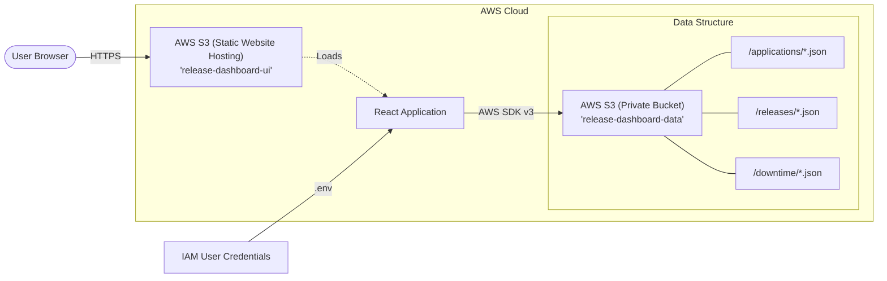

# Deployment & Hosting Guide
## Centralized Release & Downtime Dashboard
**Technology Stack:** React + AWS S3 + JSON

---

## 1. Getting Started
Before you begin, ensure you have the project files on your machine.
1. **Unzip the Project**: Extract the provided `.zip` file to a folder on your computer.
2. **Open Terminal**: Navigate to the extracted folder in your terminal or command prompt.
3. **Install Dependencies**: Run the following command to install necessary libraries:
   ```bash
   npm install
   ```

---

## 2. Objective of Deployment
This document explains how to:
- Host the React application on AWS S3.
- Configure S3 as a static website.
- Configure a second S3 bucket as a JSON "database".
- Enable required permissions, CORS, and environment configuration.
- Access and run the application successfully.

---

## 3. AWS Resources Overview
The solution uses two S3 buckets:

### Bucket 1 — Static Website Hosting (Frontend)
- **Purpose:** Host the React application (Publicly accessible).
- **Configuration:** 
  - Static website hosting enabled.
  - Public access allowed (GET only).
  - ACL enabled.
  - Public bucket policy applied.

### Bucket 2 — Database Bucket (JSON Data Storage)
- **Purpose:** Stores application data as JSON files.
- **Access:** Private bucket, controlled via AWS SDK credentials.
- **CORS:** Enabled for frontend access.
- **Folder Structure:**
  - `applications/`
  - `releases/`
  - `downtime/`

---

## 4. IAM User Setup
Create a dedicated IAM user for S3 programmatic access.

1. Go to **AWS IAM Console**.
2. **Create New User** (Name: `s3user`).
3. Select **Attach policies directly**.
4. Attach Policy: `AmazonS3FullAccess`.
   > [!NOTE]
   > This is a CLI/service user only. It is not a console user.
5. After the user is created, navigate to the user, go to the **Security Credentials** tab, and **Create Access Keys**.
6. **Generate**: Access Key and Secret Access Key.
7. **Download and store securely**. These credentials will be used in the `.env` file.

---

## 5. Setup Static Website Bucket
1. Go to **S3 Console** and **Create bucket** (e.g., `release-dashboard-ui`).
2. **Enable ACLs** and **Disable "Block all public access"** (for this bucket only).
3. **Enable Static Website Hosting**:
   - Go to **Properties** → **Static Website Hosting**.
   - Index document: `index.html`
   - Error document: `index.html`
4. **Apply Public Read Bucket Policy**:
   ```json
   {
     "Version": "2012-10-17",
     "Statement": [
       {
         "Sid": "PublicReadGetObject",
         "Effect": "Allow",
         "Principal": "*",
         "Action": "s3:GetObject",
         "Resource": "arn:aws:s3:::your-website-bucket-name/*"
       }
     ]
   }
   ```
   *Replace `your-website-bucket-name` with your actual bucket name.*

---

## 6. Setup Database Bucket
1. Create a second bucket (e.g., `release-dashboard-data`).
2. Keep it **Private** and **Block public access enabled**.
3. **Create Folder Structure** inside the bucket:
   - `applications/`
   - `releases/`
   - `downtime/`
4. **Apply CORS Policy**:
   ```json
   [
     {
       "AllowedHeaders": ["*"],
       "AllowedMethods": ["GET", "PUT", "POST", "DELETE", "HEAD"],
       "AllowedOrigins": [
         "http://localhost:5174",
         "http://localhost:3000",
         "*"
       ],
       "ExposeHeaders": []
     }
   ]
   ```

---

## 7. Configure Environment Variables
The application needs to know which AWS credentials and bucket to use. You must provide these via a `.env` file **before** building the app.

### How to create the `.env` file:
1. Look for a file named `.env.example` in the root folder.
2. **Duplicate/Copy** that file and rename the copy to exactly `.env`.
3. Open the `.env` file in a text editor.
4. Replace the placeholder values with your actual AWS credentials:
   ```env
   VITE_AWS_REGION=your-region
   VITE_AWS_BUCKET_NAME=your-database-bucket-name
   VITE_AWS_ACCESS_KEY_ID=your-access-key-id
   VITE_AWS_SECRET_ACCESS_KEY=your-secret-access-key
   ```

---

## 8. Build React Application
Run the build command:
```bash
npm run build
```
This will generate a `dist/` folder containing the optimized production files.

---

## 9. Upload Build to Static Website Bucket
1. Open your Website Bucket (`release-dashboard-ui`) in the S3 Console.
2. Click **Upload**.
3. **Add Files**: Select all files inside the `dist/` folder.
4. **Add Folder**: Upload the `assets/` folder (and any other folders in `dist/`).
5. Click **Upload**.

---

## 10. Access the Website
1. Go to **S3** → **Properties** → **Static Website Hosting**.
2. Copy the **Bucket website endpoint URL**.
3. Open the URL in your browser to access the dashboard.

---

## 11. Architecture Diagram
The following diagram illustrates how the frontend interacts with the S3 "Database" bucket using the AWS SDK.


